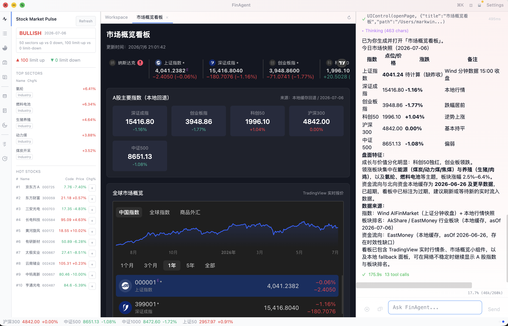

# FinAgent Workstation

FinAgent Workstation is an Electron and React finance workstation with a TypeScript agent runtime, local data store, provider provenance, dashboards, strategy workflows, and simulated-trading boundaries.

## Abilities

- Desktop agent runtime: chat agent, event agent, sessions, memory, tool execution, permission gates, workflow automation hooks, dashboard/WebView tools, and restart-diagnosable evidence.
- Finance data layer: local-first DataStore, governed provider interfaces, sidecar-backed public providers, live probes, provider matrix, API Health, source time versus fetch time, and typed readbacks.
- Provider governance: Wind, Tushare, TDX/gotdx, EastMoney, AkShare, Sina, Tencent, Yahoo/yfinance, search, macro, and research sources are routed through explicit capabilities instead of anonymous fallbacks.
- Analysis layer: market overview, stock/fund research, macro research, news/search context, risk notes, source-health evidence, and generated reports/workstation panels.
- Strategy and backtest: built-in strategy library, custom StrategySpec validation, backtest execution, saved strategy lifecycle, rerun evidence, portfolio-style comparison, and monitor/watchlist handoff.
- Workflow surfaces: Data Manager, API Health, Macro Research, Strategy Library, watchlists, dashboards, simulated trading, generated WebView reports, and evidence-first workflow tests.

## What You Can Ask

- Using available local or configured provider data, what is driving today’s A-share market, and which risks should I watch?
- Analyze 600519 using the latest available price and fundamentals, and state the data sources and freshness.
- Screen A-share stocks for profitable, reasonably valued candidates, and explain the data coverage and main risks.
- Backtest an RSI and volume strategy for 600519 without saving it.
- Compare RSI and moving-average strategies for 600519, including return, drawdown, and data coverage.
- Rerun my saved 600519 strategy and explain why its metrics changed from the previous run.
- Compare funds 110011 and 000083 using available performance and holdings data, and explain the main risks.
- Which of funds 110011 and 000083 better fits a lower-risk portfolio based on available NAV, drawdown, and holdings evidence?
- Prepare a paper-buy plan for 600519, show the evidence, and stop for confirmation before any simulated trade.
- Review my paper portfolio and prepare a rebalance proposal, but do not place any simulated trade without confirmation.

## Quick Start

### gotdx Runtime

The repository includes a prebuilt macOS arm64 `sidecar/gotdx/gotdx-server`. On a matching host, `pnpm dev` starts that binary directly; Go is not required for normal source startup. Other operating systems or CPU architectures, and developers rebuilding the sidecar, must install the Go version declared in `sidecar/gotdx/go.mod` and run `./scripts/build_gotdx.sh`. The build uses `-trimpath` so binaries do not embed build-machine source paths.

Install dependencies:

```bash
pnpm install --frozen-lockfile
```

Run the app:

```bash
pnpm dev
```

## Run Service

Build the service clients and start the app-owned loopback service:

```bash
pnpm build
node out/main/run-service-cli.js service start --port 39173
```

One-shot and long-lived JSONL clients use the same HTTP run contract:

```bash
node out/main/run-service-cli.js run "Create a market dashboard" \
  --endpoint http://127.0.0.1:39173 --session new \
  --ui-runtime headless --jsonl

node out/main/run-service-cli.js serve --stdio \
  --endpoint http://127.0.0.1:39173
```

The MCP-style stdio adapter exposes `finagent.workflow.*`,
`finagent.session.*`, `finagent.artifact.*`, and
`finagent.capability.help` operations. Configure a local MCP client with:

```json
{
  "command": "node",
  "args": ["/absolute/path/to/finagent-workstation/out/main/run-service-mcp-adapter.js"],
  "env": {
    "FINAGENT_RUN_SERVICE_ENDPOINT": "http://127.0.0.1:39173"
  }
}
```

The external harness starts a run or audits an existing run and emits one
bounded JSON verdict from typed events, tool trace, artifacts, and provenance:

```bash
node out/main/run-service-harness.js \
  --endpoint http://127.0.0.1:39173 \
  --prompt "Create and verify a dashboard" \
  --ui-runtime headless --require-tool Dashboard \
  --require-tool WebView --require-artifact dashboard
```

The service must already be running unless the one-shot CLI is invoked with
`--ensure-service`. Adapter and harness stdout is structured protocol output;
diagnostics go to stderr.

## Demonstration

The workstation combines chat-driven finance workflows, dashboard panels, local
data readback, provider provenance, and strategy surfaces in one desktop app.



## Runtime Settings

The app needs runtime settings before the agent can run real workflows. Configure them in the app settings UI or in the runtime configuration directory created by the app. Do not commit local credentials.

Minimum model settings:

- LLM provider, base URL, model, and API key.
- Recommended setup: use a strong text model as the default chat model and keep a separate vision-capable provider configured for multimodal work. UI/screenshot/dashboard workflows should call `MultimodalAgent` when visual evidence is required.
- Optional LLM HTTP user-agent header when the selected provider requires one.

Finance data settings:

- Provider credentials only for providers you intend to use. A personal research finance workstation usually fails first on data access, not on the LLM: the hard work is retrieving data, proving the provider returned the expected schema, preserving source time separately from fetch time, and reusing verified local rows before spending another external call.
- Data source options such as Wind, Tushare, search providers, Xueqiu simulated trading, yfinance/Yahoo Finance, TradingView, and sidecar-backed public providers.
- Wind / AIFinMarket: configure `WIND_API_KEY` only if you have access from Wind AIFinMarket. Use it for licensed professional data, macro series, documents, and advanced finance facts; quota and permission limits are provider-owned and should be visible in API health.
- Tushare: configure `TUSHARE_TOKEN` from a Tushare account when you need supported A-share reference data. Some statement/fund endpoints require extra permissions; unsupported or permission-gated endpoints should stay disabled instead of being advertised as normal workflows.
- AkShare / EastMoney / Sina / Tencent public data: these are useful public-provider paths for A-share, fund, market-structure, news, and ranking data. They should be accessed through governed interfaces and probes, not treated as anonymous fallback blobs.
- yfinance / Yahoo Finance: use for global instruments, options, corporate actions, news, and cross-market context through the Python sidecar and typed readback tables. It normally needs global web access or a working proxy.
- Search providers: configure only the search engines you actually use. They provide research context and source discovery, not canonical market-data tables.
- Xueqiu simulated trading: configure cookies/session data only for simulated-trading validation. Keep it separate from real broker execution and refresh cookies outside source control.
- TradingView: use it as a visual/chart enhancement layer when web access is available; it is not the canonical storage source for reusable data.
- Optional local proxy settings when your network requires them.
- Global web access or a working proxy for providers that depend on overseas web services, especially yfinance/Yahoo Finance and TradingView.
- Runtime data directory for sessions, memory, generated dashboards, local cache, provider evidence, logs, and user-created artifacts.

Data-source comparison:

| Source group | Best use | Main boundary | Provenance treatment |
|---|---|---|---|
| Local readback / SQLite | Reusing previously verified rows, dashboards, reports, strategy reruns, and offline-ish continuity | Only valid when freshness and coverage match the workflow | Prefer first; show cache status, source time, fetch time, provider, and schema/table. |
| TDX / gotdx | A-share quote, K-line, index, tick, transactions, and market-structure data | Requires local gotdx/runtime health; endpoint encodings are schema-specific | Persist registered schemas and classify runtime or transport failures in API Health. |
| EastMoney / AkShare | A-share, fund, sector, hot-list, news, ranking, flow, and market-structure public data | Sidecar/route health and wrapper behavior can drift | Normalize through provider-specific adapters; keep invalid-parameter and transport failures separate. |
| Sina / Tencent | Extra public A-share quote/K-line/ranking coverage and fallback diversity | Public endpoints are selective and should not be assumed complete | Register only verified capabilities and keep unsupported rows out of normal routing. |
| Wind / AIFinMarket | Licensed professional, macro, fundamental, document, and advanced finance data | Credential, quota, and permission gated | Prefer cache/readback; expose quota, permission, and credential status before live refresh. |
| Tushare Pro | Structured A-share reference data when the token has permission | Endpoint permissions vary by account | Disable unsupported endpoints and avoid retry loops after permission failure. |
| yfinance / Yahoo Finance | Global instruments, cross-market context, profile, options, actions, holders, and news | Needs Python sidecar plus global web access or proxy | Persist typed global datasets; do not replace China A-share primary providers. |
| Search, macro, and research pages | Narrative explanation, macro attribution, event context, and source discovery | Not automatically canonical market data | Store evidence with source/date/hash where supported; promote only stable schemas into reusable tables. |

Credential and access matrix:

| Data source | Key required | Where to get / configure | Main use |
|---|---|---|---|
| TDX / gotdx public market data | No API key | Local gotdx sidecar/runtime path | A-share quote, K-line, index and market-structure paths. |
| EastMoney public data | No API key | Public EastMoney routes | A-share, ETF, sector, hot-rank, flow, limit-pool and related public data. |
| AkShare public wrappers | No API key | Python sidecar with AkShare installed | Useful compatibility path; still needs sidecar health and schema validation. |
| Sina public finance data | No API key | Public Sina finance routes through governed provider paths | A-share public data when verified by probes. |
| Tencent public finance data | No API key | Public Tencent/proxy.finance.qq.com routes through governed provider paths | Quote/K-line/ranking style public data when verified by probes. |
| Wind / AIFinMarket | `WIND_API_KEY` | Wind AIFinMarket / Wind account or portal | Professional, macro, fundamental, document and advanced finance data; quota and permission gated. |
| Tushare Pro | `TUSHARE_TOKEN` | Tushare account -> personal center -> account token | Structured A-share reference data; endpoint permissions vary by account. |
| Yahoo Finance / yfinance-style global data | No API key in this app | Public Yahoo/yfinance-compatible routes; workstation uses Python sidecar | Global quote/history/research/options/actions; usually needs global web access or proxy. |
| TradingView visual/chart layer | No API key in this app | Web access / embedded chart resources | Visual chart enhancement, not canonical persisted data. |
| Brave Search | `BRAVE_SEARCH_KEY` | Brave Search API dashboard | Research/source discovery, not canonical market data. |
| Tavily Search | `TAVILY_API_KEY` | Tavily Platform dashboard | Research/source discovery and extraction, not canonical market data. |
| FRED macro data | `FRED_API_KEY` | FRED account API key page | Official US macro/rates series. |
| BLS public macro data | No API key in current implementation | BLS public API / public releases | US labor/inflation evidence; rate limits and source availability still apply. |
| BEA macro data | `BEA_API_KEY` or `~/.fin_electron/bea.txt` fallback | BEA API signup | US national accounts and growth evidence. |
| EIA energy data | `EIA_API_KEY` | EIA Open Data API registration | Energy inventory/commodity macro evidence. |
| Xueqiu simulated trading | `XQ_COOKIE`; optional `XQ_PORTFOLIO` | Logged-in Xueqiu browser session and simulation group ids/names | Simulation validation only; keep separate from real broker execution. |
| Public macro/research pages | Usually no API key | Official/public pages; sometimes browser/manual validation | Research narrative and attribution evidence until promoted into governed schema. |

Service dependencies:

- Electron, Node.js, and pnpm for local development.
- Sidecar-backed providers may require Python, local sidecar startup, or provider-specific runtime paths.
- External finance providers may require network access, credentials, quota, cookies, sidecars, or provider-specific runtime paths.
- Missing credentials should block only the credentialed provider path; local readback and public-source workflows should remain usable.

Runtime data such as sessions, dashboards, generated reports, logs, cache, memory, cookies, and API keys belongs outside this repository.

## Design Guides

Design guides are part of the source contract. They are added as the corresponding code domains appear. When a design guide is added or materially changed, update both `README.md` and `README.zh.md` in the same source-change commit so the README describes the code at that point in history.

English:

- `docs/design/agent/agent-design-guide.md`
- `docs/design/data-provenance/data-provenance-design-guide.md`
- `docs/design/strategy-provenance/strategy-provenance-design-guide.md`
- `docs/design/workflow-phase/workflow-phase-design-guide.md`

Chinese:

- `docs/design/agent/agent-design-guide.zh.md`
- `docs/design/data-provenance/data-provenance-design-guide.zh.md`
- `docs/design/strategy-provenance/strategy-provenance-design-guide.zh.md`
- `docs/design/workflow-phase/workflow-phase-design-guide.zh.md`

## Development

Validate TypeScript and tests:

```bash
pnpm exec tsc --noEmit --pretty false
pnpm test
```

Build:

```bash
pnpm build
```

## Repository Layout

```text
assets/ Bundled skills, dashboards, schema assets, and runtime prompts
docs/design/ Bilingual design guides, added as the related code domains appear
scripts/ Provider audits, probes, maintenance, and workflow helpers
sidecar/ Optional local provider sidecar code
src/ Electron main process, TypeScript agent runtime, and React UI
test/ Unit and workflow-oriented regression tests
```

## Safety Boundary

This project is for research, education, and workflow assistance. It does not provide investment advice. Trading-related workflows must keep simulated and real broker paths separate, require explicit approval for side effects, and record the evidence used for each decision.

Do not commit API keys, cookies, tokens, local proxy settings, runtime sessions, or generated data into this repository.

## License

Apache License 2.0. See `LICENSE`.
